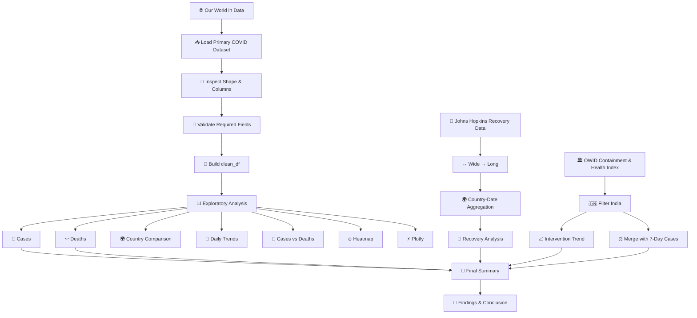

<div align="center">

# 🦠 COVID-19 Visualization Data Analysis

### 🌍 From Pandemic Data → Visual Intelligence → Actionable Insights

<p>


</p>

<p>
<b>📊 Exploratory Data Analysis &nbsp;•&nbsp; 📈 Time-Series Analytics &nbsp;•&nbsp; 🌍 Country Comparison &nbsp;•&nbsp; ⚡ Interactive Visualization</b>
</p>

</div>

---

## 🧠 Project Identity

**COVID-19 Visualization Data Analysis** is a Python-based exploratory analytics project that transforms historical pandemic datasets into visual and comparative insights.

The project investigates:

- 🦠 COVID-19 case growth
- ⚰️ COVID-19 death trends
- 📅 daily new cases and deaths
- 🌍 country-wise differences
- 🔗 cases vs deaths relationship
- 🔥 country/date heatmap patterns
- ⚡ interactive country comparison
- 💚 historical recovery trends
- 🏛️ India's containment & health intervention trend
- ⚖️ intervention trends alongside India's 7-day average new cases

> **Analytical principle:** The visualizations are designed to describe patterns in the reported data. Similar movement between two variables should not be interpreted as proof of causation.

---

# 📊 Project Dashboard

| Dimension | Project Coverage |
|---|---|
| 🗂️ Original dataset | **607,209 records × 61 columns** |
| 🧩 Main analytical fields | Country, Date, Total Cases, New Cases, Total Deaths, New Deaths |
| 🌍 Primary scope | Global / country-level COVID-19 analysis |
| 🇮🇳 Special analysis | India government intervention vs case trend |
| 💚 Additional dataset | Historical recovery data |
| 📈 Visualization types | Line, Bar, Scatter, Heatmap, Interactive Plotly |
| 🧰 Core stack | Python, Pandas, NumPy, Matplotlib, Seaborn, Plotly |
| 📓 Development | Jupyter Notebook / Google Colab |

The notebook first loads the large Our World in Data COVID-19 dataset and then creates a focused `clean_df` containing the six fields required for the main analysis.

---

# 🎯 Project Objectives

### Primary goals

1. Load and inspect real-world COVID-19 data.
2. Validate required analytical columns.
3. Clean and structure data for analysis.
4. Analyze worldwide case trends.
5. Analyze worldwide death trends.
6. Identify Top 10 countries by cases and deaths.
7. Compare selected countries over time.
8. Analyze daily new cases and deaths.
9. Examine the relationship between total cases and deaths.
10. Build a country/date heatmap.
11. Create an interactive Plotly visualization.
12. Transform and analyze historical recovery data.
13. Visualize India's government intervention trend.
14. Compare intervention data with India's 7-day average new cases.
15. Produce a final comparative summary and findings.

---

# 🏗️ Analytical Architecture



---

# 🔬 Data Architecture

## 01 — Primary COVID-19 Dataset

**Source:** Our World in Data

The notebook loads the compact COVID-19 dataset directly from its online source.

### Main fields selected for analysis

```text
country
date
total_cases
new_cases
total_deaths
new_deaths
```

### Preparation performed

```text
Raw Data
   ↓
Required Columns
   ↓
Datetime Conversion
   ↓
Numeric Conversion
   ↓
Missing Required Values Removed
   ↓
Country + Date Sorting
   ↓
Index Reset
   ↓
clean_df
```

---

## 02 — Historical Recovery Dataset

**Source:** Johns Hopkins CSSE historical recovery data

The recovery dataset initially uses a wide structure where dates appear as columns.

The notebook converts it into analytical long format:

```text
Province/State
Country/Region
Lat
Long
Date
Recovered
```

It then aggregates recovered cases by:

```text
Country/Region + Date
```

This creates the `recovery_country` analytical dataset.

---

## 03 — Government Intervention Dataset

**Source:** Our World in Data — COVID-19 Containment and Health Index

The notebook:

1. loads the intervention dataset,
2. inspects its columns,
3. filters records for **India**,
4. converts `Day` to datetime,
5. visualizes the Containment and Health Index,
6. merges intervention data with India's COVID-19 case data.

For the comparison, India's new cases are transformed into a **7-day rolling average** before being compared with the intervention index.

---

# 📈 Analysis Suite

## 01. 🌍 Worldwide COVID-19 Cases

**Visualization:** Line chart

The notebook groups `total_cases` by date and sums across countries to visualize the worldwide reported case trajectory.

### Analytical purpose

> Identify the broad growth pattern of reported COVID-19 cases over time.

---

## 02. ⚰️ Worldwide COVID-19 Deaths

**Visualization:** Line chart

The notebook aggregates `total_deaths` by date to visualize the worldwide reported death trajectory.

### Analytical purpose

> Examine how reported COVID-19 deaths evolved throughout the analyzed period.

---

## 03. 🏆 Top 10 Countries by Total Cases

**Visualization:** Horizontal bar chart

Countries are grouped by their maximum reported `total_cases` and the Top 10 are selected.

### Analytical purpose

> Identify countries with comparatively high reported total case counts.

---

## 04. 🕯️ Top 10 Countries by Total Deaths

**Visualization:** Horizontal bar chart

Countries are grouped by maximum `total_deaths` and ranked to identify the Top 10.

### Analytical purpose

> Compare the reported death burden across countries.

---

## 05. 🌍 Selected-Country Case Comparison

### Countries analyzed

- 🇮🇳 India
- 🇺🇸 United States
- 🇧🇷 Brazil
- 🇬🇧 United Kingdom

**Visualization:** Multi-line comparison

### Analytical purpose

> Observe how reported total-case trajectories differ across selected countries.

---

## 06. ⚰️ Selected-Country Death Comparison

The same four countries are compared using `total_deaths`.

**Visualization:** Multi-line comparison

### Analytical purpose

> Examine differences in reported death trajectories between selected countries.

---

## 07. 📅 Daily New Cases

The notebook aggregates `new_cases` by date.

**Visualization:** Time-series line chart

### Analytical purpose

> Detect periods of rapid growth, peaks, and fluctuations in reported daily cases.

---

## 08. 🕯️ Daily New Deaths

The notebook aggregates `new_deaths` by date.

**Visualization:** Time-series line chart

### Analytical purpose

> Identify periods with increased reported daily deaths.

---

## 09. 🔗 Relationship Between Cases & Deaths

The notebook creates a country-level summary using the maximum values of:

```text
total_cases
total_deaths
```

**Visualization:** Scatter plot

### Analytical purpose

> Visually investigate the relationship between reported total cases and reported total deaths.

> ⚠️ **Important:** A relationship visible in a scatter plot does not establish a causal relationship.

---

## 10. 🔥 COVID-19 Cases Heatmap

The selected countries are transformed into a country × date matrix.

### Countries

```text
India
United States
Brazil
United Kingdom
```

The notebook reduces the date density by taking every 30th date for clearer visualization.

**Visualization:** Seaborn heatmap

### Analytical purpose

> Provide a compact visual overview of reported case levels across countries and time.

---

## 11. ⚡ Interactive COVID-19 Visualization

**Technology:** Plotly Express

The notebook creates an interactive line chart for the four selected countries.

### Interactive experience

- 🖱️ Hover over points
- 📅 Inspect dates
- 🔢 Inspect case values
- 🌍 Compare countries interactively
- 🔎 Explore the time-series visually

---

## 12. 💚 Recovery Trend Analysis

Historical recovery data is transformed from wide format to long format and aggregated by country/date.

### Selected countries

```text
India
US
Brazil
United Kingdom
```

**Visualization:** Multi-line recovery trend

### Analytical purpose

> Explore historical reported recovery trends across selected countries.

---

## 13. 🏛️ Government Intervention Trend — India

The notebook isolates:

```text
Entity = India
```

and visualizes:

```text
COVID-19 Containment and Health Index
```

against date.

### Analytical purpose

> Observe how reported containment and health-related intervention levels changed over time in India.

---

## 14. ⚖️ Government Intervention vs New Cases — India

This is one of the project's more advanced comparative sections.

### Pipeline

```text
India New Cases
      ↓
Daily Aggregation
      ↓
7-Day Rolling Average
      ↓
        ↘
         Merge by Date
        ↗
India Intervention Index
      ↓
Dual-Axis Visualization
```

### Compared metrics

**Left axis**
- 7-Day Average New Cases

**Right axis**
- COVID-19 Containment and Health Index

### Analytical purpose

> Visually compare the timing and movement of intervention levels alongside reported case trends.

> ⚠️ **Interpretation:** This is a descriptive comparison. It does not prove that intervention policies caused changes in case numbers.

---

# 🧠 Final Comparative Summary

The notebook creates a final table combining:

| Metric | Meaning |
|---|---|
| `Country` | Selected country |
| `Total Cases` | Maximum reported total cases |
| `Total Deaths` | Maximum reported total deaths |
| `Recovered Cases` | Maximum historical reported recoveries |

Selected countries:

```text
India
United States
Brazil
United Kingdom
```

The notebook then programmatically identifies:

- 🥇 country with highest total cases
- 🥇 country with highest total deaths
- 🥇 country with highest recovered cases

This makes the final interpretation **data-driven rather than manually assumed**.

---

# 🧹 Data Cleaning & Transformation

The primary dataset is prepared through a controlled pipeline.

### Operations performed

- ✅ Required column selection
- ✅ Date conversion with `pd.to_datetime()`
- ✅ Numeric conversion using `pd.to_numeric()`
- ✅ Invalid numeric values converted to missing values
- ✅ Removal of rows missing critical analysis fields
- ✅ Sorting by country and date
- ✅ Index reset
- ✅ Grouping and aggregation
- ✅ Recovery dataset reshaping
- ✅ Country/date recovery aggregation
- ✅ 7-day rolling average for India's new cases
- ✅ Date-based merge of intervention and case data

---

# 📊 Visualization Matrix

| Analysis | Chart | Library |
|---|---|---|
| Worldwide cases | Line | Matplotlib |
| Worldwide deaths | Line | Matplotlib |
| Top 10 cases | Horizontal Bar | Seaborn |
| Top 10 deaths | Horizontal Bar | Seaborn |
| Country case comparison | Multi-line | Seaborn |
| Country death comparison | Multi-line | Seaborn |
| Daily new cases | Line | Matplotlib |
| Daily new deaths | Line | Matplotlib |
| Cases vs deaths | Scatter | Seaborn |
| Cases heatmap | Heatmap | Seaborn |
| Interactive comparison | Interactive Line | Plotly |
| Recovery trend | Multi-line | Seaborn |
| India intervention | Line | Matplotlib |
| Intervention vs cases | Dual-axis | Matplotlib |

---

# 🛠️ Technical Stack

```text
                 ┌─────────────────────┐
                 │       Python        │
                 └──────────┬──────────┘
                            │
          ┌─────────────────┼─────────────────┐
          ↓                 ↓                 ↓
      ┌────────┐        ┌────────┐       ┌────────┐
      │ Pandas │        │ NumPy  │       │ Plotly │
      └────────┘        └────────┘       └────────┘
          │                 │                 │
          └─────────────────┼─────────────────┘
                            ↓
                  ┌──────────────────┐
                  │ Matplotlib       │
                  │ + Seaborn        │
                  └──────────────────┘
                            ↓
                  📊 Data Visualization
```

---

# 📁 Repository Structure

```text
COVID-19-Visualization-Data-Analysis/
│
├── 📓 1_COVID_19_Visualization_Data_Analysis.ipynb
│
├── 📄 covid_data.csv
│
├── 📘 README.md


```

> 💡 The `screenshots/` folder is optional but strongly recommended for a premium GitHub presentation.

---

# 🚀 How to Run

## Option A — Google Colab

1. Open the `.ipynb` file in Google Colab.
2. Run the cells from top to bottom.
3. The notebook loads the required online datasets.
4. Visualizations are generated as the analysis progresses.

## Option B — Jupyter Notebook

Install dependencies:

```bash
pip install pandas numpy matplotlib seaborn plotly
```

Open:

```text
1_COVID_19_Visualization_Data_Analysis.ipynb
```

Then execute all cells sequentially.

---

# 🔗 Data Sources

### 🌐 Our World in Data

COVID-19 dataset:

https://ourworldindata.org/covid-data

Containment & Health Index:

https://ourworldindata.org/grapher/covid-containment-and-health-index

### 🏥 Johns Hopkins CSSE

Historical COVID-19 recovery dataset:

https://github.com/CSSEGISandData/COVID-19

---

# 🧠 Key Analytical Takeaways

### 🌍 Global perspective
The project provides a broad view of how reported cases and deaths changed over time.

### 🇺🇸🇮🇳🇧🇷🇬🇧 Country differences
Comparative time-series charts demonstrate that different countries experienced different reported trajectories.

### 📅 Daily volatility
Daily case/death analysis makes peaks and fluctuations easier to identify than cumulative values alone.

### 🔗 Cases vs deaths
The country-level scatter plot provides a visual relationship between reported case totals and death totals.

### 💚 Recovery perspective
The historical recovery dataset adds another dimension to the pandemic analysis.

### 🏛️ Policy context
India's intervention index provides additional context when viewed alongside case trends.

### 🧠 Responsible interpretation
The project intentionally treats visual relationships as descriptive evidence rather than automatically calling them causal relationships.

---

# ⚠️ Data Limitations & Responsible Analysis

COVID-19 data is affected by differences in:

- testing capacity
- reporting practices
- definitions and methodology
- historical revisions
- recovery reporting
- missing data
- country-specific data collection

Therefore:

> **Reported data ≠ complete real-world impact**

The project should be interpreted as a **historical exploratory data-analysis and visualization study**.

---

# 🎓 Academic Learning Outcomes

Through this project, the following practical skills were demonstrated:

- 🐍 Python programming
- 🐼 Pandas data analysis
- 🔢 NumPy numerical operations
- 🧹 Data cleaning
- 🔎 Exploratory Data Analysis
- 📅 Time-series analysis
- 🌍 Country-wise comparison
- 📊 Statistical visualization
- 🎨 Matplotlib
- 🔥 Seaborn
- ⚡ Plotly
- 🔄 Data reshaping
- 🧩 Data aggregation
- 🔗 Dataset merging
- 📈 Rolling-average analysis
- 🧠 Data interpretation
- 📋 Professional data presentation

---

# 👩‍💻 Author

<div align="center">

## **Chand Khimani**

**BCA Final Year Student**  
**Data Analysis Course**

### 👨‍🏫 Guided By

**Prof. Girish Gondaliya Sir**

</div>

---

# 🏁 Project Status

<div align="center">

### ✅ ANALYSIS COMPLETED

**Data Loading • Cleaning • EDA • Visualization • Country Comparison • Recovery Analysis • Intervention Analysis • Final Findings**

</div>

---

<div align="center">

# 🦠 COVID-19 Visualization Data Analysis

### **Turning Raw Pandemic Data into Visual Intelligence**

<br>

`Python` `Pandas` `NumPy` `Matplotlib` `Seaborn` `Plotly`

<br><br>

⭐ **Academic Data Analysis Project** ⭐

</div>
