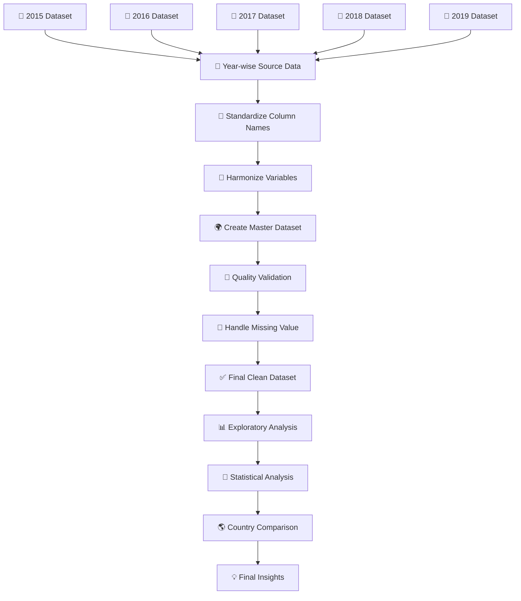

<div align="center">

# 🌍 GLOBAL HAPPINESS REPORT ANALYSIS
## **The Happiness Intelligence Lab**

### 📊 Measuring the World • Comparing Countries • Understanding the Drivers of Happiness

<br>


<br><br>

**A multi-year exploratory data-analysis project built around World Happiness Report data from 2015–2019.**

</div>

---

<div align="center">

### 🧭 **DATA → CLEANING → EXPLORATION → CORRELATION → COMPARISON → INSIGHT**

</div>

---

# ✦ 01 — PROJECT VISION

> ### **What makes a country happy?**

Happiness is not represented by a single number alone. It can reflect a combination of economic strength, social support, health, freedom, generosity, and perceptions of corruption.

This project transforms **five years of World Happiness Report data** into a structured analytical story.

Instead of stopping at basic rankings, the notebook progressively moves from:

**Data Understanding → Data Quality → Exploratory Analysis → Factor Relationships → Year-wise Trends → Country-level Change → Statistical Analysis → Final Insights**

The goal is to understand **which factors are most strongly associated with happiness, how happiness changes across years, and how countries differ from one another.**

---

# ✦ 02 — PROJECT AT A GLANCE

<table align="center">
<tr>
<td align="center"><b>📅 2015–2019</b><br>Analysis Period</td>
<td align="center"><b>782</b><br>Country-Year Records</td>
<td align="center"><b>170</b><br>Unique Countries</td>
<td align="center"><b>9</b><br>Final Variables</td>
</tr>
</table>

### 📌 Dataset Snapshot

| Metric | Value |
|---|---:|
| Analysis period | **2015–2019** |
| Records | **782** |
| Countries | **170** |
| Years | **5** |
| Final columns | **9** |
| Missing values after cleaning | **0** |
| Duplicate country-year combinations | **Validated** |
| Main analytical factors | **6** |

---

# ✦ 03 — THE ANALYTICAL QUESTION

This project is built around one central question:

## **“Which socioeconomic and well-being factors are most strongly associated with happiness across countries?”**

To answer it, the analysis investigates six major factors:

| Factor | Analytical Meaning |
|---|---|
| 💰 **GDP per Capita** | Economic condition indicator |
| 🤝 **Social Support** | Availability of social/community support |
| ❤️ **Life Expectancy** | Healthy life expectancy indicator |
| 🕊️ **Freedom** | Freedom to make life choices |
| 🎁 **Generosity** | Generosity-related indicator |
| 🏛️ **Corruption Perception** | Perception related to corruption/trust |

---

# ✦ 04 — DATA ENGINEERING PIPELINE



### 🔥 Why harmonization matters

The World Happiness Report editions used across 2015–2019 did not always use identical variable names.

The notebook therefore creates a common structure before combining the yearly datasets.

Examples include:

```text
economy_gdp_per_capita
        ↓
gdp_per_capita

family
        ↓
social_support

health_life_expectancy
        ↓
life_expectancy

trust_government_corruption
        ↓
corruption_perception
```

This makes multi-year comparison possible without treating differently named variables as unrelated fields.

---

# ✦ 05 — DATA CLEANING & QUALITY CONTROL

The notebook follows a deliberate quality-control workflow rather than immediately plotting the raw files.

## 🔎 Quality checks performed

### ① Column-name standardization
A reusable function:

```python
clean_column_names()
```

standardizes column names by:

- removing leading/trailing spaces
- converting names to lowercase
- replacing spaces with underscores
- removing special characters

### ② Variable identification

Relevant columns are programmatically identified using keywords related to:

```text
happiness
gdp
economy
social
support
health
life
freedom
generosity
corruption
```

### ③ Country identification

Country/region/name-style columns are inspected before standardization.

### ④ Missing-value audit

The notebook calculates both:

- Missing Values
- Missing Percentage

### ⑤ Duplicate validation

Two levels are checked:

```text
Complete duplicate rows
        +
Country-Year duplicate combinations
```

### ⑥ Missing-value treatment

One missing `corruption_perception` value is handled using **median imputation**.

### ⑦ Post-cleaning validation

The final dataset is checked again to confirm that remaining missing values are zero.

---

# ✦ 06 — FINAL DATA MODEL

The cleaned dataset contains exactly **9 analytical columns**:

```text
year
country
happiness_score
gdp_per_capita
social_support
life_expectancy
freedom
generosity
corruption_perception
```

### 🧬 Data structure

```text
                    GLOBAL HAPPINESS DATA
                             │
                 ┌───────────┴───────────┐
                 │                       │
               YEAR                   COUNTRY
                 │                       │
                 └───────────┬───────────┘
                             │
                      HAPPINESS SCORE
                             │
        ┌────────────┬───────┼────────┬────────────┐
        ↓            ↓       ↓        ↓            ↓
      GDP       Support    Health   Freedom    Generosity
                             │
                             ↓
                       Corruption
```

---

# ✦ 07 — EXPLORATORY DATA ANALYSIS

## 📊 Descriptive Statistics

The notebook calculates:

```text
count
mean
standard deviation
minimum
25th percentile
median
75th percentile
maximum
```

for the happiness score and six selected explanatory factors.

This establishes the statistical baseline before deeper relationship analysis.

---

## 📈 Global Happiness Trend

The notebook calculates year-wise:

- Average Happiness
- Median Happiness
- Minimum Happiness
- Maximum Happiness
- Number of Countries

A line visualization then tracks the **average happiness score from 2015 to 2019**.

---

## 📊 Happiness Distribution

A histogram with KDE is used to understand the distribution of happiness scores across country-year observations.

This helps answer:

> **Are most observations concentrated around a particular happiness range, or is the distribution widely spread?**

---

# ✦ 08 — HAPPINESS FACTOR LAB

Each major factor receives its own relationship analysis.

### 💰 GDP per Capita → Happiness

A regression visualization evaluates the relationship between GDP per capita and happiness.

### 🤝 Social Support → Happiness

The analysis examines whether stronger social support is associated with higher happiness.

### ❤️ Life Expectancy → Happiness

The relationship between healthy life expectancy and happiness is visualized.

### 🕊️ Freedom → Happiness

The project evaluates the association between freedom to make life choices and happiness.

### 🎁 Generosity → Happiness

The relationship between generosity and happiness is examined.

### 🏛️ Corruption Perception → Happiness

The analysis explores the relationship between corruption perception and happiness.

Each factor uses:

```text
Scatter Data
      +
Regression Line
      +
Pearson Correlation
```

---

# ✦ 09 — CORRELATION INTELLIGENCE

The project goes beyond visual inspection by calculating a **Pearson correlation matrix**.

## 🔥 Overall correlation ranking

Based on the supplied cleaned dataset, the approximate relationships with happiness are:

| Rank | Factor | Pearson r |
|---:|---|---:|
| 🥇 1 | GDP per Capita | **0.789** |
| 🥈 2 | Life Expectancy | **0.742** |
| 🥉 3 | Social Support | **0.649** |
| 4 | Freedom | **0.551** |
| 5 | Corruption Perception | **0.397** |
| 6 | Generosity | **0.138** |

### 🧠 What this means

In this dataset, **GDP per Capita shows the strongest positive linear association with happiness**, followed by life expectancy and social support.

Generosity shows the weakest positive linear association among the selected factors.

> ⚠️ **Correlation ≠ causation.** These values describe statistical association and do not prove that a factor directly causes happiness.

---

# ✦ 10 — YEAR-WISE STATISTICAL INTELLIGENCE

The analysis does not assume that relationships remain identical every year.

For each year from **2015 to 2019**, the notebook calculates the correlation between happiness and every selected factor.

### 🔥 Year-wise correlation heatmap

This creates a matrix:

```text
             GDP   Support   Health   Freedom   Generosity   Corruption
2015
2016
2017
2018
2019
```

The heatmap makes changes in relationship strength visually identifiable.

---

## 📐 Correlation Stability

The project also calculates:

- Average Correlation
- Minimum Correlation
- Maximum Correlation
- Correlation Standard Deviation
- Absolute Average Correlation

This adds another layer:

> **Not only “how strong is the relationship?” but also “how consistently does it appear across years?”**

---

# ✦ 11 — COUNTRY INTELLIGENCE

The notebook creates a country-level summary containing:

```text
Average Happiness
Highest Happiness
Lowest Happiness
Years Observed
```

This enables countries to be compared using more than a single year's score.

---

## 🏆 Top 10 Countries by Average Happiness

Countries are ranked by:

```text
Average_Happiness
```

and visualized using a horizontal bar chart.

---

## 📉 Bottom 10 Countries by Average Happiness

The lowest average-happiness countries are also visualized.

This creates a balanced comparison:

```text
TOP 10
  ↕
GLOBAL COUNTRY DISTRIBUTION
  ↕
BOTTOM 10
```

---

# ✦ 12 — HAPPINESS CHANGE ENGINE

One of the more interesting parts of the notebook is the country change analysis.

For every country, the notebook identifies:

```text
First observed year
        ↓
First happiness score
        ↓
Last observed year
        ↓
Last happiness score
        ↓
Difference
```

### Formula

```text
Happiness Change
=
Last-Year Score − First-Year Score
```

This allows the project to identify:

### 🚀 Largest Happiness Improvements
Countries with the greatest positive change.

### 📉 Largest Happiness Declines
Countries with the greatest negative change.

This is more informative than simply asking:

> “Which country is happiest?”

It asks:

> **“Which countries changed the most?”**

---

# ✦ 13 — SIMPLE COUNTRY COMPARISON

The notebook also performs direct country-ranking analysis.

### 🏆 Top 10 Happiest Country-Year Records

The analysis ranks individual country-year observations by happiness score.

### 📉 Bottom 10 Happiest Country-Year Records

The lowest individual country-year observations are also identified.

### 📅 2019 Snapshot

A dedicated analysis ranks the **Top 10 countries in 2019**.

This provides a focused single-year perspective alongside the five-year analysis.

---

# ✦ 14 — FACTOR PROFILE

The project calculates average values for:

```text
Happiness Score
GDP per Capita
Social Support
Life Expectancy
Freedom
Generosity
Corruption Perception
```

The six explanatory factors are then visualized to compare their average levels.

---

# ✦ 15 — INSIGHT ENGINE

The notebook programmatically generates a final set of findings.

It identifies:

### 📌 Overall
- Average happiness score

### 🏆 Highest
- Highest happiness score
- Country
- Year

### 📉 Lowest
- Lowest happiness score
- Country
- Year

### 🔎 Strongest relationship
- Factor
- Correlation
- Relationship direction

### 📅 Year-wise
- Highest average-happiness year
- Lowest average-happiness year

This makes the final section **data-driven and reproducible**.

---

# ✦ 16 — VERIFIED DATA SNAPSHOT

Using the cleaned project CSV:

| Metric | Result |
|---|---:|
| Average Happiness Score | **5.379** |
| Highest Happiness Score | **7.769** |
| Highest-scoring country/year | **Finland — 2019** |
| Lowest Happiness Score | **2.693** |
| Lowest-scoring country/year | **Central African Republic — 2017** |
| Unique countries | **170** |
| Years | **5** |
| Records | **782** |
| Missing values after cleaning | **0** |

These values are calculated directly from the supplied `global_happiness_2015_2019_clean.csv`.

---

# ✦ 17 — VISUALIZATION SYSTEM

| Analysis Layer | Visualization | Purpose |
|---|---|---|
| Global trend | 📈 Line Chart | Year-wise happiness movement |
| Distribution | 📊 Histogram + KDE | Score distribution |
| Correlation | 🔥 Heatmap | Factor relationships |
| Factor analysis | 📉 Regression Plot | Relationship + trend |
| Factor ranking | 📊 Bar Chart | Correlation strength |
| Country ranking | 🏆 Horizontal Bar | Top/bottom countries |
| Country change | 📈 Data Table | Improvement/decline |
| Year comparison | 📊 Bar Chart | 2019 ranking |
| Standardized factors | 📈 Multi-line | Comparative factor trends |
| Year-wise correlation | 🔥 Heatmap | Relationship stability |

---

# ✦ 18 — PROJECT STRUCTURE

```text
Global-Happiness-Report-Analysis/
│
├── 📓 Global_Happiness_Report_Analysis.ipynb
│
├── 📄 global_happiness_2015_2019_clean.csv
│
├── 📘 README.md

```

---

# ✦ 19 — TECHNOLOGY STACK

<div align="center">

| Technology | Role |
|---|---|
| 🐍 **Python** | Core analysis language |
| 🐼 **Pandas** | Data manipulation & aggregation |
| 🔢 **NumPy** | Numerical operations |
| 📊 **Matplotlib** | Visualization |
| 🎨 **Seaborn** | Statistical visualization |
| 📓 **Jupyter / Colab** | Interactive notebook environment |
| 🤖 **Scikit-learn** | Standardization using `StandardScaler` |

</div>

---

# ✦ 20 — HOW TO RUN

## ① Open the notebook

Open:

```text
Global_Happiness_Report_Analysis.ipynb
```

in Google Colab or Jupyter Notebook.

## ② Install required libraries

```bash
pip install pandas numpy matplotlib seaborn scikit-learn
```

## ③ Execute sequentially

Run the notebook from top to bottom.

The notebook is intentionally organized as a progressive analytical workflow:

```text
01 → Data Loading
02 → Data Understanding
03 → Data Cleaning
04 → EDA
05 → Factor Analysis
06 → Comparative Analysis
07 → Statistical Analysis
08 → Key Findings
09 → Conclusion
```

---

# ✦ 21 — DATA SOURCES

The notebook analyzes yearly **World Happiness Report** datasets covering **2015–2019**.

The project combines yearly datasets into a harmonized master structure because variable names changed between report editions.

> **Source note:** The README reflects the sources and terminology used in the supplied notebook. For exact source URLs/licensing details, refer to the source metadata or notebook cells accompanying the yearly datasets.

---

# ✦ 22 — LIMITATIONS

A professional analysis should also state what the data **cannot** establish.

### ⚠️ Time limitation
The project covers only **2015–2019**.

### ⚠️ Variable harmonization
Some variable definitions/names changed across report editions and required harmonization.

### ⚠️ Imputation
One missing corruption-perception value was handled using median imputation.

### ⚠️ Correlation limitation
Pearson correlation measures linear association; it does not establish causation.

### ⚠️ Country comparability
Country-level comparisons may be influenced by differences in methodology and data availability.

### ⚠️ Unobserved factors
Happiness can be influenced by many social, political, cultural, demographic, and environmental factors not represented in the selected variables.

---

# ✦ 23 — FUTURE SCOPE 🚀

The project can evolve from an academic analysis into a full **Happiness Intelligence Platform**.

### 🔮 Phase 01 — Dashboard

Build an interactive dashboard using:

```text
Power BI / Tableau / Streamlit
```

with:

- country selector
- year selector
- KPI cards
- dynamic rankings
- factor comparison
- interactive charts

### 🔮 Phase 02 — Predictive Analytics

Use machine learning to estimate happiness scores from selected factors.

Possible models:

```text
Linear Regression
Random Forest
Gradient Boosting
XGBoost
```

### 🔮 Phase 03 — Explainable AI

Use feature importance / SHAP-style analysis to investigate:

> Which variables contribute most strongly to model predictions?

### 🔮 Phase 04 — Global Comparison Engine

Build a country comparison interface:

```text
Country A
    VS
Country B
```

with side-by-side factor profiles.

### 🔮 Phase 05 — Longer Time Horizon

Extend the dataset beyond 2019 to investigate more recent global happiness trends.

---

# ✦ 24 — WHAT THIS PROJECT DEMONSTRATES

This project demonstrates practical ability in:

```text
✓ Real-world dataset handling
✓ Multi-year data harmonization
✓ Data cleaning
✓ Missing-value analysis
✓ Duplicate validation
✓ Exploratory Data Analysis
✓ Descriptive statistics
✓ Time-series comparison
✓ Correlation analysis
✓ Regression visualization
✓ Country ranking
✓ Trend analysis
✓ Standardization
✓ Statistical interpretation
✓ Professional visualization
✓ Insight generation
```

---

# ✦ 25 — ACADEMIC VALUE

This is more than a collection of charts.

The notebook demonstrates a complete analytical lifecycle:

```text
RAW DATA
   ↓
UNDERSTAND
   ↓
STANDARDIZE
   ↓
VALIDATE
   ↓
CLEAN
   ↓
EXPLORE
   ↓
MEASURE
   ↓
COMPARE
   ↓
INTERPRET
   ↓
COMMUNICATE
```

That makes the project suitable as a **BCA Data Analysis academic project / portfolio project**.

---

# ✦ 26 — AUTHOR

<div align="center">

## 👩‍💻 **Chand Khimani**

### BCA Final Year  
### Data Analysis Course

<br>

### 👨‍🏫 Guided By

## **Prof. Girish Gondaliya Sir**

</div>

---

# ✦ 27 — PROJECT STATUS

<div align="center">

## 🟢 ANALYSIS COMPLETE

| Component | Status |
|---|:---:|
| Data Loading | ✅ |
| Data Understanding | ✅ |
| Data Harmonization | ✅ |
| Data Cleaning | ✅ |
| Quality Validation | ✅ |
| EDA | ✅ |
| Factor Analysis | ✅ |
| Correlation Analysis | ✅ |
| Year-wise Analysis | ✅ |
| Country Comparison | ✅ |
| Insight Generation | ✅ |
| Conclusion | ✅ |
| Future Scope | ✅ |

</div>

---

# ✦ 28 — FINAL TAKEAWAY

<div align="center">

## 🌍 **HAPPINESS IS DATA — BUT DATA NEEDS CONTEXT.**

This project uses data to explore the relationships between  
**economic conditions, social support, health, freedom, generosity,  
corruption perception, and reported happiness.**

### 📊 The objective is not simply to find the “happiest country”.

### 🧠 The objective is to understand **the patterns behind happiness.**

</div>

---

<div align="center">

# 🌍 GLOBAL HAPPINESS REPORT ANALYSIS

### **Turning Global Data into Human-Centered Insights**

<br>

`Python` • `Pandas` • `NumPy` • `Matplotlib` • `Seaborn` • `Scikit-learn`

<br><br>

### ⭐ Built as a Data Analysis Learning Project ⭐

**Chand Khimani | BCA Final Year | Data Analysis**

</div>
