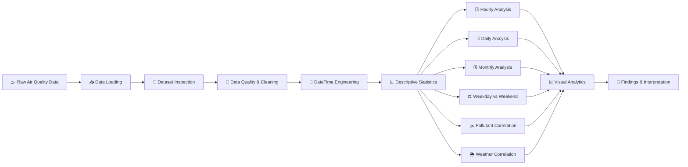

<div align="center">

# 🌍 Air Quality Analysis
## Advanced Environmental Data Intelligence & Visualization

<p>
  
  
  
  
  
  
</p>

<p>
  <b>🌫️ Explore • 📊 Analyze • 📈 Visualize • 🧠 Interpret</b>
</p>

<p>
  A professional environmental data-analysis project designed to transform
  historical air-quality sensor measurements into meaningful temporal,
  statistical, correlation, and weather-related insights.
</p>

</div>

---

## ✨ Project at a Glance

<table>
<tr>
<td align="center"><b>📊 9,471</b><br>Records analyzed</td>
<td align="center"><b>🧩 17</b><br>Original columns</td>
<td align="center"><b>🌫️ 5</b><br>Pollutants analyzed</td>
<td align="center"><b>📈 10+</b><br>Analysis dimensions</td>
</tr>
</table>

> **Project Focus:** Turning raw air-quality sensor observations into structured environmental intelligence using Python-based data analysis and visualization.

---

## 🧭 Navigation

- [🎯 Objectives](#-objectives)
- [📦 Dataset Architecture](#-dataset-architecture)
- [🛠️ Technology Stack](#️-technology-stack)
- [🔄 Analytical Pipeline](#-analytical-pipeline)
- [📊 Analysis Modules](#-analysis-modules)
- [🧹 Data Preparation](#-data-preparation)
- [🕒 Temporal Intelligence](#-temporal-intelligence)
- [🔗 Correlation Intelligence](#-correlation-intelligence)
- [🌦️ Weather Relationships](#️-weather-relationships)
- [📅 Weekday vs Weekend](#-weekday-vs-weekend)
- [🖼️ Visualization Gallery](#️-visualization-gallery)
- [📁 Repository Structure](#-repository-structure)
- [🚀 Run the Project](#-run-the-project)
- [🔍 Key Insights](#-key-insights)
- [⚠️ Data Limitations](#️-data-limitations)
- [🔮 Future Scope](#-future-scope)
- [👨‍💻 Author](#-author)
- [🎓 Academic Information](#-academic-information)

---

# 🎯 Objectives

This project was created to transform historical air-quality measurements into a structured exploratory data-analysis experience.

### Core objectives

| # | Objective | Outcome |
|---|---|---|
| 01 | Load & inspect the dataset | Understand structure, variables, and data types |
| 02 | Validate data quality | Identify missing values, empty columns, and duplicates |
| 03 | Clean & prepare data | Build an analysis-ready dataset |
| 04 | Engineer time features | Create year, month, day, hour, and day-type dimensions |
| 05 | Analyze pollutant distributions | Understand central tendency and variability |
| 06 | Analyze hourly patterns | Identify common high-pollution periods |
| 07 | Analyze daily & monthly trends | Detect pollutant-specific peaks |
| 08 | Compare pollutants | Understand co-movement and relative behavior |
| 09 | Study weather relationships | Examine pollutant associations with T, RH, and AH |
| 10 | Compare weekdays & weekends | Identify differences in average pollutant levels |

---

# 📦 Dataset Architecture

The project uses the **Air Quality UCI** dataset containing historical sensor measurements and atmospheric variables.

### 🧬 Primary Dataset

The raw dataset contains:

> **9,471 records × 17 original columns**

The data includes:

- date and time information
- measured pollutant concentrations
- sensor-response variables
- temperature
- relative humidity
- absolute humidity

The project engineers additional temporal variables so the raw dataset becomes more suitable for multi-dimensional EDA.

### 🧪 Pollutant Variables

| Variable | Description / Role |
|---|---|
| `CO(GT)` | Carbon monoxide measurement |
| `NMHC(GT)` | Non-methane hydrocarbons |
| `C6H6(GT)` | Benzene-related measurement |
| `NOx(GT)` | Nitrogen oxides |
| `NO2(GT)` | Nitrogen dioxide |

### 🌦️ Atmospheric Variables

| Variable | Role |
|---|---|
| `T` | Temperature |
| `RH` | Relative humidity |
| `AH` | Absolute humidity |

### 📡 Sensor Variables

The dataset also includes sensor-response fields such as:

- `PT08.S1(CO)`
- `PT08.S2(NMHC)`
- `PT08.S3(NOx)`
- `PT08.S4(NO2)`
- `PT08.S5(O3)`

---

# 🛠️ Technology Stack

<table>
<tr>
<th>Technology</th>
<th>Role in Project</th>
</tr>
<tr>
<td>🐍 <b>Python</b></td>
<td>Core programming language</td>
</tr>
<tr>
<td>🐼 <b>Pandas</b></td>
<td>Data loading, cleaning, transformation and aggregation</td>
</tr>
<tr>
<td>🔢 <b>NumPy</b></td>
<td>Numerical operations and statistical calculations</td>
</tr>
<tr>
<td>📊 <b>Matplotlib</b></td>
<td>Static charts and analytical visualization</td>
</tr>
<tr>
<td>🎨 <b>Seaborn</b></td>
<td>Statistical plots and correlation heatmaps</td>
</tr>
<tr>
<td>📓 <b>Jupyter / Google Colab</b></td>
<td>Interactive notebook development and execution</td>
</tr>
</table>

---

# 🔄 Analytical Pipeline



---

# 📊 Analysis Modules

## 01 — 🔎 Dataset Inspection

The project begins by examining the raw dataset before performing analysis.

### Inspection includes

- number of rows and columns
- column names
- data types
- first and last observations
- descriptive statistics
- missing-value profile
- duplicate records
- completely empty columns

**Goal:** Understand the dataset before making analytical decisions.

---

## 02 — 🧹 Data Quality Analysis

The raw dataset contains two completely empty columns:

```text
Unnamed: 15
Unnamed: 16
```

These columns contain no useful observations and are treated as data-quality artifacts rather than analytical variables.

The workflow also checks missing values and duplicates before analysis.

> **Data philosophy:** Data-quality issues are inspected and documented instead of being silently ignored.

---

## 03 — 📅 DateTime Engineering

Separate date and time information is transformed into a unified temporal structure.

The project derives:

```text
DateTime
Year
Month
Day
Hour
Day_Type
```

### Why it matters

This enables the same dataset to be analyzed across multiple time scales:

```text
Year
 ↓
Month
 ↓
Day
 ↓
Hour
```

---

## 04 — 🌫️ Pollutant Distribution Analysis

The project evaluates five major pollutant variables:

- `CO(GT)`
- `NMHC(GT)`
- `C6H6(GT)`
- `NOx(GT)`
- `NO2(GT)`

The analysis considers:

- mean
- median
- minimum
- maximum
- standard deviation
- distribution shape
- variability

---

## 05 — 🕒 Hourly Pollution Analysis

Hourly grouping is used to identify recurring intraday pollution patterns.

### Major result

> **19:00 is the highest-average hour for all five analyzed pollutants.**

| Pollutant | Peak Hour | Average |
|---|---:|---:|
| `CO(GT)` | **19:00** | 3.73 |
| `NMHC(GT)` | **19:00** | 479.41 |
| `C6H6(GT)` | **19:00** | 17.74 |
| `NOx(GT)` | **19:00** | 364.00 |
| `NO2(GT)` | **19:00** | 150.09 |

This is one of the strongest shared temporal patterns identified in the project.

> 🧠 **Interpretation:** The common 19:00 peak indicates synchronized temporal movement among the measured pollutants. It does not, by itself, prove the exact emission source or cause.

---

## 06 — 📈 Daily Peak Analysis

Daily averages are calculated separately for each pollutant.

| Pollutant | Highest Average Day | Daily Average |
|---|---|---:|
| `CO(GT)` | 20-Oct-2004 | 5.65 |
| `NMHC(GT)` | 15-Apr-2004 | 574.47 |
| `C6H6(GT)` | 23-Nov-2004 | 23.84 |
| `NOx(GT)` | 23-Nov-2004 | 847.43 |
| `NO2(GT)` | 11-Feb-2005 | 223.35 |

### Analytical takeaway

Different pollutants reach their maximum daily averages on different dates.

This shows why pollutant-specific analysis is more informative than relying on a single overall pollution metric.

---

## 07 — 🗓️ Monthly Pollution Analysis

Monthly averages reveal pollutant-specific high points.

| Pollutant | Peak Month | Average |
|---|---:|---:|
| `CO(GT)` | December | 2.75 |
| `NMHC(GT)` | May | 275.00 |
| `C6H6(GT)` | October | 13.53 |
| `NOx(GT)` | November | 424.19 |
| `NO2(GT)` | February | 160.69 |

> ⚠️ These values describe the available historical dataset and should not automatically be generalized to every location or future year.

---

# 📊 Pollutant Intelligence

## Statistical Summary

| Pollutant | Mean | Median | Minimum | Maximum | Std Dev |
|---|---:|---:|---:|---:|---:|
| `CO(GT)` | 2.15 | 1.80 | 0.10 | 11.90 | 1.45 |
| `NMHC(GT)` | 218.81 | 150.00 | 7.00 | 1189.00 | 204.46 |
| `C6H6(GT)` | 10.08 | 8.20 | 0.10 | 63.70 | 7.45 |
| `NOx(GT)` | **246.90** | 180.00 | 2.00 | **1479.00** | **212.98** |
| `NO2(GT)` | 113.09 | 109.00 | 2.00 | 340.00 | 48.37 |

### 🏆 Highest Average

**NOx(GT) — 246.90**

### 📉 Lowest Average

**CO(GT) — 2.15**

### 📊 Highest Variability

**NOx(GT) — Standard Deviation 212.98**

---

# 🔗 Correlation Intelligence

Correlation analysis is used to understand how pollutant measurements move together.

### 🥇 Strongest Pollutant Relationship

> **CO(GT) ↔ C6H6(GT) = 0.931**

This represents a very strong positive association within the analyzed observations.

### Other notable relationships

| Relationship | Correlation |
|---|---:|
| `CO(GT)` ↔ `C6H6(GT)` | **0.931** |
| `NMHC(GT)` ↔ `C6H6(GT)` | **0.903** |
| `CO(GT)` ↔ `NMHC(GT)` | **0.890** |
| `NMHC(GT)` ↔ `NOx(GT)` | **0.813** |
| `CO(GT)` ↔ `NOx(GT)` | **0.795** |
| `NOx(GT)` ↔ `NO2(GT)` | **0.763** |

> ⚠️ **Important:** Correlation measures statistical association. It does not establish causation.

---

# 🌦️ Weather Relationships

The project investigates relationships between pollutants and:

- 🌡️ Temperature (`T`)
- 💧 Relative Humidity (`RH`)
- 💦 Absolute Humidity (`AH`)

### Strongest weather-pollutant relationship

> **Temperature ↔ NMHC(GT) = 0.392**

| Weather Variable | Pollutant | Correlation |
|---|---|---:|
| `T` | `NMHC(GT)` | **0.392** |
| `AH` | `NO2(GT)` | **-0.335** |
| `AH` | `NMHC(GT)` | 0.270 |
| `T` | `NOx(GT)` | -0.270 |
| `RH` | `NOx(GT)` | 0.221 |
| `T` | `C6H6(GT)` | 0.199 |
| `RH` | `NMHC(GT)` | -0.191 |

### 🧠 Analytical interpretation

The strongest pollutant-pollutant relationship is considerably stronger than the strongest weather-pollutant relationship in this analysis.

This suggests that the measured pollutants show stronger statistical co-movement with one another than with the selected weather variables.

---

# 📅 Weekday vs Weekend

The project compares average pollutant levels between weekdays and weekends.

| Pollutant | Weekday | Weekend |
|---|---:|---:|
| `CO(GT)` | **2.36** | 1.65 |
| `NMHC(GT)` | **243.47** | 134.06 |
| `C6H6(GT)` | **11.25** | 7.28 |
| `NOx(GT)` | **268.08** | 193.60 |
| `NO2(GT)` | **118.42** | 99.70 |

### 🔍 Main observation

All five analyzed pollutants show a higher average value on **weekdays** than on weekends.

> 🧠 **Interpretation caution:** The comparison identifies a pattern in the data, but does not independently establish the reason for the difference.

---

# 🖼️ Visualization Gallery

> 📌 **Recommended:** Add the actual notebook output screenshots here. This section is designed to become the visual showcase of the GitHub repository.

### 🌫️ Pollutant Distribution

`[ Add screenshot of pollutant distribution chart here ]`

### 🕒 Hourly Pollution Pattern

`[ Add screenshot of hourly pollution chart here ]`

### 📈 Daily Pollution Trend

`[ Add screenshot of daily trend chart here ]`

### 🗓️ Monthly Pollution Analysis

`[ Add screenshot of monthly analysis chart here ]`

### 🔥 Pollutant Correlation Heatmap

`[ Add screenshot of pollutant correlation heatmap here ]`

### 🌦️ Weather Correlation Heatmap

`[ Add screenshot of weather-pollutant heatmap here ]`

### ⚖️ Weekday vs Weekend

`[ Add screenshot of weekday/weekend comparison here ]`

---

# 🧹 Data Preparation

Before visualization and statistical analysis, the project follows a structured preprocessing workflow.

### Data-processing workflow

```text
Raw CSV
   ↓
CSV Parsing
   ↓
Dataset Inspection
   ↓
Data-Type Validation
   ↓
Missing-Value Analysis
   ↓
Empty-Column Detection
   ↓
Duplicate Check
   ↓
Date + Time Combination
   ↓
Temporal Feature Engineering
   ↓
Pollutant Selection
   ↓
Analysis-Ready Dataset
```

### Cleaning operations

- Explicit CSV separator handling
- Decimal-format handling
- Empty-column identification
- Missing-value inspection
- Duplicate inspection
- Date conversion
- Time conversion
- DateTime creation
- Year/month/day/hour extraction
- Weekday/weekend classification

---

# 📁 Repository Structure

```text
AIR-QUALITY-ANALYSIS/
│
├── 📓 AIR_QUALITY_ANALYSIS.ipynb
│
├── 📄 AirQualityUCI.csv
│
├── 📊 pollutant_summary.csv
│
├── 📊 pollutant_weather_correlations.csv
│
├── 📘 README.md
│
├── 🖼️ screenshots/
│   ├── pollutant_distribution.png
│   ├── hourly_pollution.png
│   ├── daily_trends.png
│   ├── monthly_analysis.png
│   ├── pollutant_correlation.png
│   ├── weather_correlation.png
│   └── weekday_weekend.png
│
└── 📁 outputs/
    └── charts/
```

### File responsibilities

| File | Purpose |
|---|---|
| `AirQualityUCI.csv` | Primary dataset |
| `AIR_QUALITY_ANALYSIS.ipynb` | Complete analysis notebook |
| `pollutant_summary.csv` | Computed pollutant statistics |
| `pollutant_weather_correlations.csv` | Weather-pollutant correlation output |
| `README.md` | Project documentation and presentation |
| `screenshots/` | Visual portfolio showcase |
| `outputs/` | Optional exported charts |

---

# 🚀 Run the Project

## 1️⃣ Clone / Download

Download the repository to your computer.

## 2️⃣ Open the Notebook

Open:

```text
AIR_QUALITY_ANALYSIS.ipynb
```

using **Google Colab**, **Jupyter Notebook**, or **JupyterLab**.

## 3️⃣ Install Dependencies

```bash
pip install pandas numpy matplotlib seaborn jupyter
```

## 4️⃣ Run the Notebook

Execute the notebook cells from top to bottom.

The notebook follows:

```text
Load → Inspect → Clean → Engineer → Analyze → Visualize → Interpret
```

---

# 🔍 Key Insights

## 📈 01 — NOx has the highest average

Among the five analyzed pollutants, **NOx(GT)** has the highest mean measured value:

> **246.90**

---

## 📊 02 — NOx is the most variable

`NOx(GT)` also has the highest standard deviation:

> **212.98**

This indicates substantial variation in its measured values.

---

## 🕒 03 — 19:00 is the common peak hour

All five pollutants reach their highest average hourly value at:

> **19:00**

This is the project's most prominent shared temporal pattern.

---

## 🔗 04 — CO and C6H6 have the strongest relationship

The strongest pollutant correlation is:

> **CO(GT) ↔ C6H6(GT) = 0.931**

---

## 🌦️ 05 — Temperature has the strongest weather relationship

The strongest absolute weather-pollutant correlation is:

> **T ↔ NMHC(GT) = 0.392**

---

## ⚖️ 06 — Weekdays have higher averages

All five analyzed pollutants have higher average measurements on weekdays than weekends.

---

## 🗓️ 07 — Peak periods differ by pollutant

Daily and monthly peak periods are not identical across pollutants.

This reinforces the importance of analyzing each pollutant separately.

---

# ⚠️ Data Limitations

A professional environmental analysis must clearly define its boundaries.

### Important limitations

- The dataset represents historical measurements from a specific monitoring context.
- Pollutant variables use different measurement scales.
- Missing or invalid sensor readings can influence results.
- The analysis is observational rather than experimental.
- Correlation does not establish causation.
- Peak values represent observed measurements and should not automatically be treated as regulatory exceedances.
- The available data does not by itself identify the exact emission source behind a pollution peak.
- A single monitoring location cannot represent every geographic area.

> **Final interpretation:** This project should be understood as a historical exploratory data-analysis study of air-quality measurements, not as a complete environmental or regulatory assessment.

---

# 🔮 Future Scope

The project can be extended into a more advanced environmental intelligence system.

### 🌍 Multi-location Analysis

Combine air-quality stations from multiple cities and regions.

### 🚗 Traffic Integration

Add traffic density, congestion, and mobility data to investigate possible source relationships.

### 🌦️ Advanced Meteorology

Integrate:

- wind speed
- wind direction
- atmospheric pressure
- rainfall
- visibility

### 🤖 Machine Learning

Build models for:

- pollutant forecasting
- anomaly detection
- pollution-level classification
- peak-event prediction

### 📊 Interactive Dashboard

Build a professional dashboard using:

- Plotly
- Dash
- Power BI
- Streamlit

### 🚨 Pollution Alert System

Create automated alerts when pollutant levels show unusual patterns.

### 🛰️ Geographic Intelligence

Integrate GIS or geospatial data to create pollution maps and location-based comparisons.

---

# 🧠 Skills Demonstrated

<table>
<tr>
<td>🐍 Python Programming</td>
<td>🐼 Pandas</td>
<td>🔢 NumPy</td>
</tr>
<tr>
<td>🧹 Data Cleaning</td>
<td>📊 Exploratory Data Analysis</td>
<td>📈 Statistical Analysis</td>
</tr>
<tr>
<td>🕒 Time-Series Analysis</td>
<td>🔗 Correlation Analysis</td>
<td>🌦️ Weather Analysis</td>
</tr>
<tr>
<td>🎨 Matplotlib</td>
<td>🔥 Seaborn</td>
<td>📋 Data Presentation</td>
</tr>
<tr>
<td>🧩 Feature Engineering</td>
<td>🧠 Insight Generation</td>
<td>📓 Jupyter / Colab</td>
</tr>
</table>

---

# 🏁 Project Status

<div align="center">

### ✅ COMPLETED

**Data Cleaning • EDA • Temporal Analysis • Correlation Analysis • Weather Analysis • Findings**

</div>

---

# 👨‍💻 Author

<div align="center">

## **Chand Khimani**

**BCA Final Year Student**  
**Data Analysis Course**

<br>

### 👨‍🏫 Guided By

**Prof. Girish Gondaliya Sir**

</div>

---

# 🎓 Academic Information

This project was developed as part of academic learning in **Data Analysis**, with practical emphasis on:

- Data loading and handling
- Data cleaning
- Exploratory Data Analysis
- Statistical analysis
- Time-based feature engineering
- Temporal analysis
- Correlation analysis
- Environmental data interpretation
- Visualization
- Professional project documentation

---

<div align="center">

## 🌍 Air Quality Analysis

**Turning Environmental Data into Analytical Intelligence**

<br>

`Python` • `Pandas` • `NumPy` • `Matplotlib` • `Seaborn` • `Jupyter`

<br>

⭐ **Advanced Academic Data Analysis Project** ⭐

</div>
